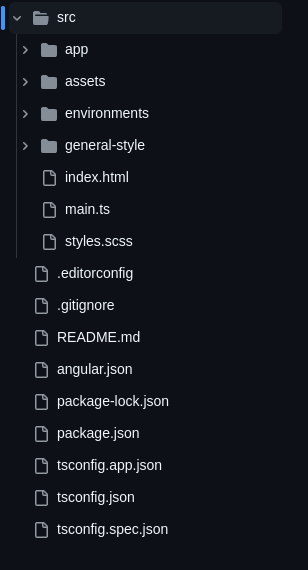

## Estilo y Diseño

Escogí este diseño porque pienso que se adapta mejor al objetivo de la aplicación. La barra de navegación está situada en la parte superior, con la información del usuario y la búsqueda, lo que permite aprovechar mejor el espacio para las tareas.

Considero que el diseño de las tareas es conveniente para mostrar información clara con un diseño limpio y con acciones claras que el usuario puede realizar.

Los colores principalmente fueron inspirados en los colores de **atomchat.io** y algunos colores de **Material Colors**.

## Tecnologías utilizadas

### Front-end

El Front-end está desarrollado en **JavaScript/TypeScript** utilizando **Angular 18** como framework, lo que permite crear una interfaz de usuario robusta y escalable, con componentes, rutas, middlewares y utilitarios.

Además, se implementó la librería **Angular Material** para aprovechar los componentes que esta provee.

### Estructura del proyecto

A continuación se muestra la estructura de carpetas del proyecto:

### Despliegue

El despliegue del Front-end se realizó en **Firebase Hosting**.

# AtomTasksFrontend

This project was generated with [Angular CLI](https://github.com/angular/angular-cli) version 18.1.1.

## Development server

Run `ng serve` for a dev server. Navigate to `http://localhost:4200/`. The application will automatically reload if you change any of the source files.

## Code scaffolding

Run `ng generate component component-name` to generate a new component. You can also use `ng generate directive|pipe|service|class|guard|interface|enum|module`.

## Build

Run `ng build` to build the project. The build artifacts will be stored in the `dist/` directory.

## Running unit tests

Run `ng test` to execute the unit tests via [Karma](https://karma-runner.github.io).

## Running end-to-end tests

Run `ng e2e` to execute the end-to-end tests via a platform of your choice. To use this command, you need to first add a package that implements end-to-end testing capabilities.

## Further help

To get more help on the Angular CLI use `ng help` or go check out the [Angular CLI Overview and Command Reference](https://angular.dev/tools/cli) page.
